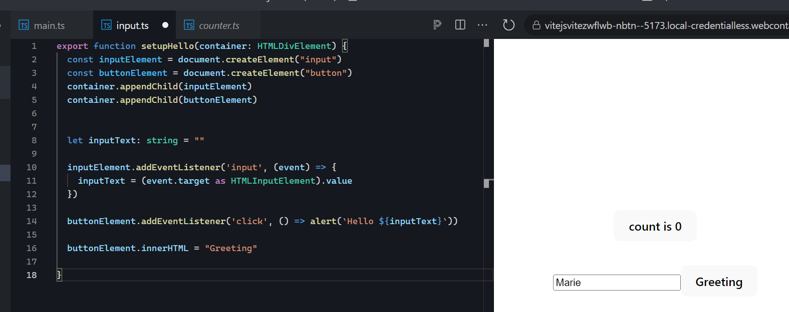
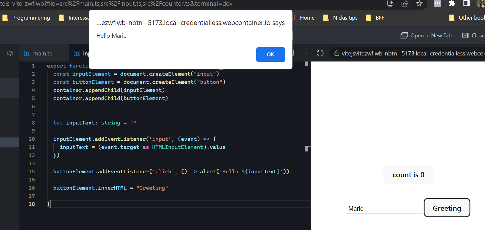

# Week 3 Exercise: Typescript vs Javascript
## Part 1: Working in the browser
Check out [stackblitz](https://blog.stackblitz.com/posts/vite-new-templates/)
1. Try creating a new project with the `vanilla-ts` template (in browser: vite.new/vanilla-ts)
<span style="color:orange">SVAR 1:</span>
<span style="color:orange">Done.</span>


2. Take a look at the counter.ts and see how it works

<span style="color:orange">SVAR 2:</span>
<span style="color:orange">Det er en tæller, der tæller op, hver gang man klikker på en knap.</span>


3. Now create your own file with an input field and a button. When the button is clicked, it should alert a `Hello <inputname` to the user.
- Hints:
    - use `document.createElement('input');` and `document.createElement('button');` to create the elements.
    - Send a div element `(container: HTMLDivElement)` to the function as a container for both the input and the button.
    - use `container.appendChild(element)` to add the elements to the container.

<span style="color:orange">SVAR 3:</span>






## Part 2: Making your own project
1. Create a new typescript project with `vite init project-name -- --template vanilla-ts`
2. Create a class called Person that has the following properties and methods:

Properties:
`name`: string
`age`: number
`occupation`: string
`private_salary`: number
`Constructor`:
- The constructor should take in three arguments: name, age, and occupation.
- It should initialize the properties with the provided values
- It should also have a default value of salary 0.
  *Methods*:
  `introduce()`: a method that returns a string introducing the person, in the format "Hello, my name is {name} and I am a {occupation}. I earn {salary}$"
  `incrementAge()`: a method that increases the person's age by one
  `setSalary(salary:int)`: a method that takes in a number as an argument, and sets the value of salary to that number.
  `getSalary():int`: a method that returns the value of salary
  Here's an example of how the class could be used:

```typescript
const john = new Person("John Smith", 30, "software developer");
console.log(john.introduce()); // "Hello, my name is John Smith and I am a software developer. I earn 0$"
console.log(john.age); // 30
john.incrementAge();
console.log(john.age); // 31
john.setSalary(100000);
console.log(john.getSalary()); //100000
console.log(john.introduce()); // "Hello, my name is John Smith and I am a software developer. I earn 100000$"
```

## Part 3: Working with the DOM
- Use the following [data](./people.json).
- Create a module called `people.ts` that exports a function called `getPeople()`. This function should return a promise that resolves to an array of Person objects.
- Create a module called `peopleList.ts` that exports a function called `renderPeopleList()`. This function should take in a container element and a list of people. It should render a list of people in the container element. Each person should be rendered as a div element with the following structure:
```html
<div class="person">
  <h2 class="person__name">John Smith</h2>
  <p class="person__occupation">Software Developer</p>
  <p class="person__age">30</p>
  <p class="person__salary">100000</p>
</div>
```
- Create a module called `app.ts` that imports the `getPeople()` function from `people.ts` and the `renderPeopleList()` function from `peopleList.ts`. It should then call the `getPeople()` function and render the list of people in the container element.
- Import it in the index.ts file and call the `renderPeopleList()` function.
- Make sure it shows up right in the browser.

#### Upload your solutions to github
1. Create a new folder on your github repo called `week3_ts`
2. Part 1 of ther exercise should be available as a link in the README.md file in the `week3_ts` folder.
3. Part 2 of the exercise should be available as a full project in the `week3_ts` folder.